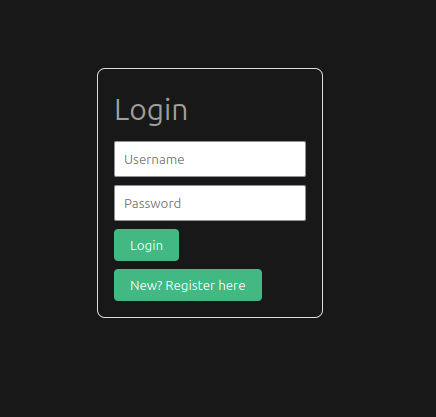
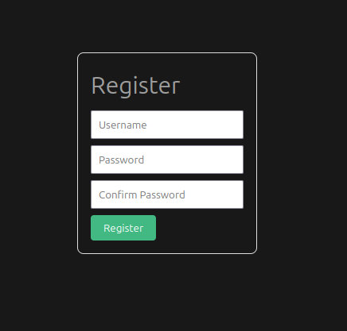
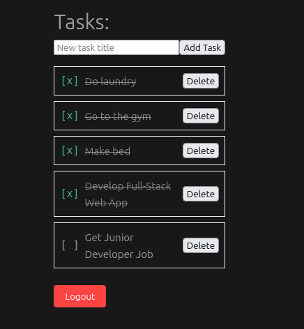

# Todo App with Django + Vue (Full-Stack)  
[Live Demo](https://todo-app-frontend-33ym.onrender.com) | [Backend API](https://todo-app-5v21.onrender.com/api/)  
## Features  
- **Task Management**: Create, read, update, delete tasks
- **JWT Authentication**: Register, login, logout
- **User-Specific Data**: Isolated tasks per account

## Tech Stack  
**Frontend**:  
- Vue 3 (Options API)
- Pinia (State management)
- Axios (API calls)
- Tailwind CSS (Styling)

**Backend**:  
- Django REST Framework (REST API)
- PostgreSQL (Database)
- SimpleJWT (Token authentication)
- django-cors-headers (Cross-origin requests)

**DevOps**:  
- Docker (Containerization)
- Render (Cloud deployment)

## Live Demo  
Explore the deployed version:  
- Frontend: [https://todo-app-frontend-33ym.onrender.com](https://todo-app-frontend-33ym.onrender.com)  
- Backend API: [https://todo-app-5v21.onrender.com/api/](https://todo-app-5v21.onrender.com/api/)  

## Learning Highlights

**Backend (Django REST Framework)**  
- **Authentication**:  
  - Implemented JWT token authentication (`SimpleJWT`) alongside Django’s built-in user model.  
  - Customized token responses to include user data.
- **API Structure**:  
  - Used `DefaultRouter` for task endpoints (`/api/tasks/`), enabling standard CRUD operations.  
  - Manual `APIView` for registration (`/api/register/`) and login to handle custom user creation logic.  
- **Permissions**:  
  - Applied `IsAuthenticated` for task endpoints.  
  - Added owner validation in `TaskViewSet` to restrict edits/deletes to task owners.  
- **Testing**:  
  - Wrote unit tests for:  
    - Task ownership enforcement (e.g., user A cannot delete user B’s tasks).  
    - Authentication requirements (blocked access without tokens).  
  - *Identified area for growth*: Testing token expiration/refresh logic.  

**Frontend (Vue 3 + Pinia)**  
- **State Management**:  
  - Stored JWT tokens in Pinia with persistence for page reloads.  
  - Implemented reactive task lists using Vue’s composition API.  
- **API Integration**:  
  - Axios interceptors to:  
    - Inject tokens into request headers.  
    - Redirect to login on `401` errors.  
- **Self-Taught Progress**:  
  - Built registration flow independently after studying login implementation.  

**DevOps**:  
- Configured multi-container Docker setup for local development.  
- Deployed to Render with production-ready environment variables.  

## Screenshots

| Feature        | Screenshot                              |
| -------------- | --------------------------------------- |
| Login Page     |          |
| Registration   |    |
| Task Dashboard |          |
